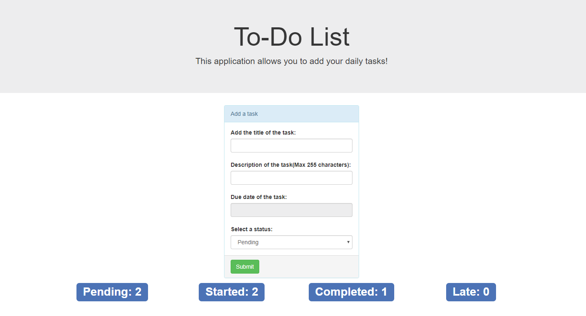

# todo-list
Application that allows user to create a todo-list.
 
<h3>Deployment Guide:</h3>
 

This application uses XAMPP Stack.

 

The database name is app1

 

The database name is app1

 

Table names:

 
<ul>
  <li>completedtasks</li>
  <li>latetasks</li>
  <li>pendingtasks</li>
  <li>startedtasks</li>
</ul>
